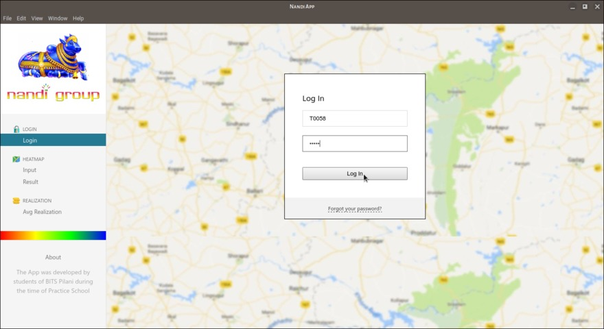
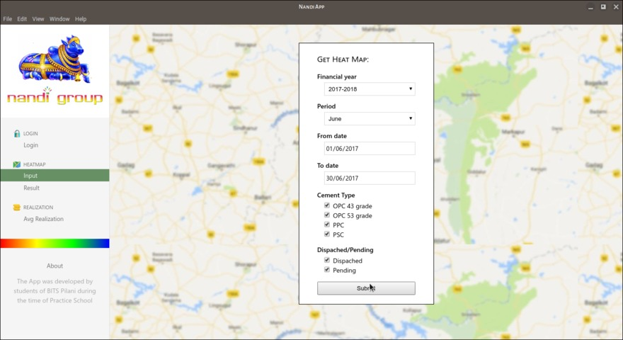
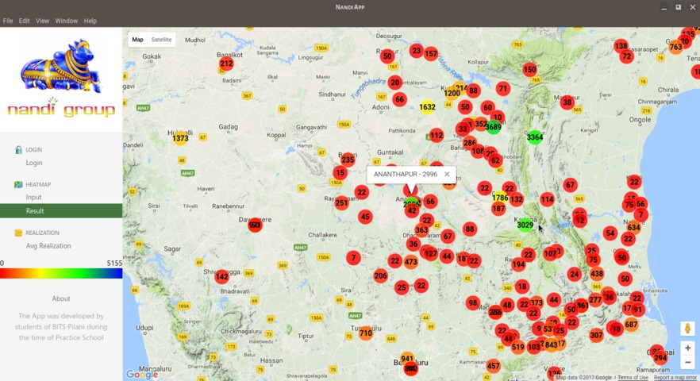

# nandi-app (In Progress)

An Electron App to visualize sales data in real time using Google Maps API for Nandi Grp of Companies

## To Use

To clone and run this repository you'll need [Git](https://git-scm.com) and [Node.js](https://nodejs.org/en/download/) (which comes with [npm](http://npmjs.com)) installed on your computer. From your command line:

```bash
# Clone this repository
git clone https://github.com/DMak21/nandi-app
# Go into the repository
cd nandi-app
# Install dependencies
npm install
# Run the app
npm start
```

## Screenshots







## License

[MIT](LICENSE.md)
